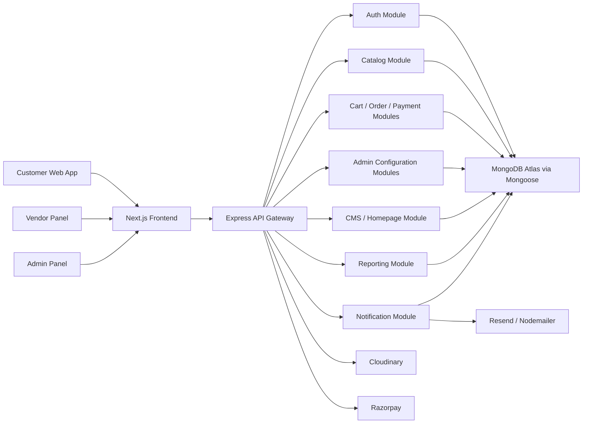
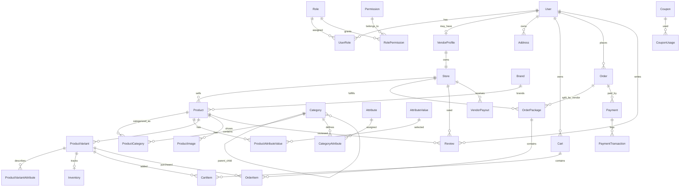

# Multi-Vendor E-Commerce Marketplace Implementation Plan

## 1. Requirements Analysis

### Source Documents

- Primary baseline: `requirements.txt`
- Expanded production directive: user-provided request in the Codex attachment

The local `requirements.txt` defines the core multi-vendor marketplace requirements: customers, vendors, admins, product management, cart, orders, payments, vendor workflow, reviews, search, notifications, reports, security, scalability, and documentation. The expanded directive adds the required target stack, enterprise architecture, fully dynamic database-driven configuration, and production-readiness constraints.

### Target Product

Build a production-ready, database-driven multi-vendor e-commerce marketplace similar in capability to Amazon, Flipkart, Etsy, and Alibaba. The system must support customer shopping flows, vendor store operations, admin governance, dynamic catalog configuration, dynamic CMS/homepage management, configurable business rules, secure payments, analytics, and deployment-ready infrastructure.

### Non-Negotiable Rules

- No hardcoded business data.
- All business configuration must be stored in PostgreSQL and managed from the admin panel.
- Default roles may be seeded, but roles and permissions must remain configurable.
- Product attributes, filters, homepage sections, order statuses, commission rules, tax rules, shipping rules, coupons, templates, menus, and dashboard widgets must be dynamic.
- Backend and frontend must use strict TypeScript.
- Implementation must follow clean architecture, SOLID, repository pattern, service layer pattern, feature-based modularity, and clear authorization boundaries.
- APIs must be documented with Swagger/OpenAPI.
- Test coverage target is 80%+ for critical backend and frontend behavior.

## 2. Recommended Technology Stack

### Frontend

- Next.js 15+ App Router
- React 19+
- TypeScript strict mode
- Tailwind CSS
- Shadcn UI
- React Hook Form
- Zod
- Zustand
- Axios
- TanStack Query

### Backend

- Node.js
- Express.js
- TypeScript strict mode
- Mongoose ODM
- PostgreSQL
- JWT access tokens
- Refresh token rotation
- Secure HTTP-only cookies
- RBAC and permission middleware

### Integrations

- Cloudinary for media storage
- Nodemailer and Resend for email delivery
- Razorpay for primary payment gateway
- Stripe-ready payment abstraction for future extension
- Swagger/OpenAPI for API documentation
- Jest, Supertest, React Testing Library for tests

### Deployment

- Frontend: Vercel
- Backend: AWS EC2, Render, or equivalent container host
- Database: Neon, Supabase, or managed PostgreSQL
- Static/media: Cloudinary
- Optional cache layer: Redis

## 3. System Architecture

### High-Level Architecture



### Backend Layering

Every backend feature should follow this internal shape:

- `routes`: HTTP route declarations and middleware composition
- `controllers`: request parsing, response shaping, orchestration boundary
- `validators`: Zod/Joi DTO validation
- `services`: business rules and transactions
- `repositories`: Mongoose data access
- `dto`: request/response contracts
- `policies`: authorization and ownership checks
- `utils`: reusable helpers

Controllers must not contain business logic. Repositories must not contain workflow logic. Services own transactions, state transitions, commission calculations, inventory reservation, and payment verification.

### Frontend Layering

The frontend should be split by user surface and feature:

- `app`: route groups and layouts
- `features`: domain-specific UI, schemas, hooks, and API clients
- `components`: shared presentational components
- `services`: Axios clients and API utilities
- `hooks`: cross-feature hooks
- `stores`: Zustand stores
- `types`: shared frontend contracts
- `utils`: formatting and helpers
- `layouts`: admin, vendor, customer, and storefront shells

## 4. Feature Breakdown

### Authentication and Account Management

- Customer registration and login
- Vendor registration and approval workflow
- Admin login
- Logout
- Refresh token rotation
- Forgot password
- Reset password
- Email verification
- Change password
- Session management
- Device/session revocation
- Password hashing with bcrypt
- Secure cookie settings by environment

### Dynamic RBAC

- Roles table
- Permissions table
- Role-permission assignments
- User-role assignments
- Permission middleware
- Admin role management UI
- Audit logs for permission changes

Default seed roles:

- Admin
- Vendor
- Customer

Default permissions should be seeded by module/action, but editable from the admin panel.

### Catalog Management

- Dynamic categories and nested subcategories
- Brands
- Attribute definitions
- Attribute values
- Category-to-attribute mapping
- Product specifications
- Product variants
- Product images
- Inventory records
- Product approval workflow
- SEO metadata

### Dynamic Filters

Filters should be generated from category-bound attributes, brands, price ranges, rating aggregates, and inventory availability. No category-specific filter names should be hardcoded in frontend or backend.

### Storefront

- Dynamic homepage sections
- Dynamic navigation menus
- Dynamic footer content
- Banners
- Featured categories
- Featured products
- Trending products
- Promotions
- CMS pages through `/page/[slug]`
- Vendor stores through `/store/[slug]`
- Product detail pages
- Category listing pages
- Search results

### Cart and Checkout

- Guest cart
- Authenticated cart
- Cart merge after login
- Save for later
- Coupon validation
- Address selection
- Shipping rule evaluation
- Tax calculation
- Payment method selection
- COD support
- Razorpay order creation and verification

### Orders

- Multi-vendor order placement
- Parent order record
- Vendor-specific order packages or shipments
- Order items linked to vendor/store
- Dynamic status workflow
- Status transition validation
- Inventory reservation and release
- Invoice generation
- Returns and refunds

### Commission and Payouts

Commission priority:

1. Vendor-specific commission
2. Category-specific commission
3. Global commission

The order service calculates vendor earnings, marketplace commission, tax, discounts, and payout eligibility. Payout records should be generated from delivered and non-refunded vendor order totals.

### CMS and Homepage Builder

- CMS pages
- Blogs
- Policies
- FAQs
- Homepage layout records
- Section type registry in database
- Section configuration as validated JSON
- Publish/draft scheduling

### Notifications

- Email templates
- In-app notification templates
- Event-driven notification dispatch
- Order confirmation
- Shipping updates
- Password reset
- Email verification
- Vendor approval/rejection
- Payout status

### Reporting and Analytics

Admin analytics:

- Gross merchandise value
- Net revenue
- Commission revenue
- Order count
- Customer count
- Vendor count
- Product count
- Vendor performance
- Payment status reports

Vendor analytics:

- Sales
- Revenue
- Earnings
- Product performance
- Inventory status
- Order status breakdown

## 5. Database Design

### Core Model Groups

Identity and access:

- `User`
- `Role`
- `Permission`
- `UserRole`
- `RolePermission`
- `RefreshToken`
- `PasswordResetToken`
- `EmailVerificationToken`
- `AuditLog`

Vendor and stores:

- `VendorProfile`
- `Store`
- `StorePolicy`
- `VendorApproval`

Catalog:

- `Category`
- `Brand`
- `Attribute`
- `AttributeValue`
- `CategoryAttribute`
- `Product`
- `ProductCategory`
- `ProductAttributeValue`
- `ProductVariant`
- `ProductVariantAttribute`
- `ProductImage`
- `Inventory`

Commerce:

- `Cart`
- `CartItem`
- `Wishlist`
- `WishlistItem`
- `Address`
- `Order`
- `OrderPackage`
- `OrderItem`
- `OrderStatus`
- `OrderStatusTransition`
- `Payment`
- `PaymentTransaction`
- `PaymentLog`
- `Invoice`
- `ReturnRequest`
- `Refund`

Business configuration:

- `Coupon`
- `CouponUsage`
- `TaxRule`
- `ShippingRule`
- `CommissionRule`
- `VendorPayout`
- `Setting`

Content and presentation:

- `CMSPage`
- `BlogPost`
- `FAQ`
- `Banner`
- `NavigationMenu`
- `NavigationMenuItem`
- `FooterSection`
- `HomepageSection`
- `DashboardWidget`

Engagement:

- `Review`
- `ReviewReport`
- `Notification`
- `NotificationTemplate`
- `EmailTemplate`

### ER Diagram



### Database Constraints and Indexing Strategy

- Unique indexes on `User.email`, `Store.slug`, `Product.slug`, `Category.slug`, `CMSPage.slug`.
- Composite indexes on high-cardinality query paths:
  - `Product(status, publishedAt)`
  - `Product(storeId, status)`
  - `ProductCategory(categoryId, productId)`
  - `ProductVariant(productId, sku)`
  - `Order(userId, createdAt)`
  - `OrderPackage(storeId, statusId, createdAt)`
  - `Payment(orderId, status)`
  - `Review(productId, status)`
- Use decimal columns for money.
- Use JSONB only for flexible presentation/config data, not for relational catalog entities that require filtering.
- Use soft deletion for user-facing business records.
- Use audit logs for privileged admin actions.
- Use database transactions for checkout, inventory, payment verification, commission calculation, and payout creation.

## 6. API Design

### API Conventions

- Base path: `/api/v1`
- Request validation: Zod DTOs
- Response shape:

```json
{
  "success": true,
  "data": {},
  "meta": {},
  "error": null
}
```

- Pagination query: `page`, `limit`, `sort`, `direction`
- Filtering query: namespaced keys, for example `filters[brand]`, `filters[attributes][ram]`
- Authorization: `requireAuth`, `requirePermission`, and ownership policies
- File uploads: signed Cloudinary uploads or API-mediated upload endpoints

### Core Endpoint Groups

| Module | Method | Route | Authorization |
| --- | --- | --- | --- |
| Auth | POST | `/auth/register` | Public |
| Auth | POST | `/auth/login` | Public |
| Auth | POST | `/auth/logout` | Authenticated |
| Auth | POST | `/auth/refresh` | Refresh cookie |
| Auth | POST | `/auth/forgot-password` | Public |
| Auth | POST | `/auth/reset-password` | Public token |
| Auth | POST | `/auth/verify-email` | Public token |
| Auth | PATCH | `/auth/change-password` | Authenticated |
| Users | GET | `/users/me` | Authenticated |
| Users | PATCH | `/users/me` | Authenticated |
| Admin Users | GET | `/admin/users` | `users.read` |
| Admin Users | PATCH | `/admin/users/:id/status` | `users.update` |
| Roles | GET | `/admin/roles` | `roles.read` |
| Roles | POST | `/admin/roles` | `roles.create` |
| Roles | PATCH | `/admin/roles/:id` | `roles.update` |
| Roles | PUT | `/admin/roles/:id/permissions` | `roles.update` |
| Vendor | POST | `/vendors/apply` | Authenticated |
| Vendor | GET | `/admin/vendors` | `vendors.read` |
| Vendor | PATCH | `/admin/vendors/:id/approval` | `vendors.approve` |
| Store | GET | `/stores/:slug` | Public |
| Store | PATCH | `/vendor/store` | Vendor |
| Categories | GET | `/categories` | Public |
| Categories | POST | `/admin/categories` | `categories.create` |
| Categories | PATCH | `/admin/categories/:id` | `categories.update` |
| Brands | GET | `/brands` | Public |
| Brands | POST | `/admin/brands` | `brands.create` |
| Attributes | GET | `/admin/attributes` | `attributes.read` |
| Attributes | POST | `/admin/attributes` | `attributes.create` |
| Products | GET | `/products` | Public |
| Products | GET | `/products/:slug` | Public |
| Products | POST | `/vendor/products` | Vendor |
| Products | PATCH | `/vendor/products/:id` | Vendor owner |
| Products | DELETE | `/vendor/products/:id` | Vendor owner |
| Products | PATCH | `/admin/products/:id/status` | `products.moderate` |
| Inventory | PATCH | `/vendor/inventory/:variantId` | Vendor owner |
| Cart | GET | `/cart` | Public/session |
| Cart | POST | `/cart/items` | Public/session |
| Cart | PATCH | `/cart/items/:id` | Public/session |
| Cart | DELETE | `/cart/items/:id` | Public/session |
| Checkout | POST | `/checkout` | Customer |
| Orders | GET | `/orders` | Customer |
| Orders | GET | `/orders/:id` | Owner/admin/vendor policy |
| Vendor Orders | GET | `/vendor/orders` | Vendor |
| Vendor Orders | PATCH | `/vendor/orders/:packageId/status` | Vendor owner |
| Admin Orders | GET | `/admin/orders` | `orders.read` |
| Payments | POST | `/payments/razorpay/create-order` | Customer |
| Payments | POST | `/payments/razorpay/verify` | Customer |
| Payments | POST | `/payments/refunds` | `payments.refund` |
| Coupons | POST | `/admin/coupons` | `coupons.create` |
| Coupons | POST | `/coupons/validate` | Customer |
| Reviews | POST | `/reviews` | Customer |
| Reviews | PATCH | `/admin/reviews/:id/status` | `reviews.moderate` |
| CMS | GET | `/pages/:slug` | Public |
| CMS | POST | `/admin/pages` | `cms.create` |
| Homepage | GET | `/homepage` | Public |
| Homepage | PUT | `/admin/homepage/sections` | `homepage.update` |
| Reports | GET | `/admin/reports/sales` | `reports.read` |
| Reports | GET | `/vendor/reports/sales` | Vendor |
| Notifications | GET | `/notifications` | Authenticated |
| Notifications | PATCH | `/notifications/:id/read` | Authenticated |

Detailed DTOs and OpenAPI schemas should be generated per module during implementation.

## 7. Folder Structure

```text
multi-vendor-ecommerce/
  apps/
    api/
      src/
        config/
        database/
        middleware/
        modules/
          auth/
          users/
          rbac/
          vendors/
          stores/
          catalog/
          inventory/
          cart/
          orders/
          payments/
          commissions/
          payouts/
          coupons/
          reviews/
          cms/
          homepage/
          notifications/
          reports/
          settings/
        shared/
          errors/
          logger/
          pagination/
          validation/
          security/
          types/
        app.ts
        server.ts
      database/
        models.ts
        mongoose.ts
        seed/
      tests/
    web/
      app/
        (storefront)/
        (auth)/
        admin/
        vendor/
        account/
      components/
      features/
        auth/
        catalog/
        cart/
        checkout/
        orders/
        admin/
        vendor/
        cms/
      hooks/
      layouts/
      services/
      stores/
      types/
      utils/
      tests/
  packages/
    shared/
      src/
        contracts/
        constants/
        utils/
  docs/
  scripts/
  .github/
    workflows/
```

## 8. Security Plan

- Use Helmet for secure headers.
- Use rate limiting for auth, password reset, checkout, and payment routes.
- Use bcrypt with strong cost factor.
- Store refresh tokens hashed in the database.
- Rotate refresh tokens on every refresh.
- Use HTTP-only, secure, same-site cookies.
- Validate every request body, query, and params object.
- Enforce RBAC and resource ownership policies.
- Use Mongoose schema validation and typed query builders for data access.
- Sanitize rich CMS input and render safely.
- Add CSRF protection for cookie-authenticated state-changing requests.
- Maintain audit logs for admin and vendor-sensitive actions.
- Add webhook signature verification for Razorpay.
- Never store raw payment card data.
- Use environment-specific CORS allowlists.

## 9. Performance and Scalability Plan

- Cursor or offset pagination for all listing endpoints.
- Database indexes for all common filters and joins.
- Image optimization through Cloudinary transformations and Next.js image handling.
- Query projection to avoid over-fetching.
- Transaction boundaries around checkout and payment confirmation.
- Background-job-ready design for notifications, reports, invoices, and payouts.
- Redis-ready cache abstraction for homepage, category trees, settings, and session-adjacent data.
- Search service interface that starts with PostgreSQL full-text search and can later move to Elasticsearch/OpenSearch.
- Avoid JSONB for filter-critical product attributes; normalize attribute values.

## 10. Testing Strategy

### Backend

- Unit tests for services:
  - Auth token rotation
  - RBAC permission checks
  - Commission resolution
  - Coupon validation
  - Tax and shipping calculations
  - Order status transition validation
- Repository integration tests against a test PostgreSQL database.
- Supertest API tests for critical flows:
  - Register/login/refresh/logout
  - Vendor application and approval
  - Product creation with dynamic attributes
  - Cart to checkout
  - Razorpay verification callback
  - Order split by vendor

### Frontend

- Component tests for forms and dynamic builders.
- Route-level tests for:
  - Login/register
  - Product listing filters
  - Cart and checkout
  - Admin category/attribute management
  - Vendor product editor
- Mock API responses using MSW or an equivalent test utility.

### Quality Gates

- TypeScript strict checks
- Linting
- Formatting
- Unit tests
- Integration tests
- API smoke tests
- Build verification

## 11. Development Roadmap

### Phase 0: Project Foundation

- Initialize monorepo.
- Configure TypeScript strict mode.
- Configure linting and formatting.
- Add Docker Compose for PostgreSQL and optional Redis.
- Add backend Express app shell.
- Add Next.js app shell.
- Add shared contracts package.
- Add CI workflow.

### Phase 1: Database and RBAC Foundation

- Create Mongoose schemas for identity, RBAC, users, sessions, audit logs, settings.
- Add migrations.
- Add seed data for default roles, permissions, order statuses, global settings.
- Implement permission middleware.
- Implement admin role and permission APIs.

### Phase 2: Authentication

- Implement registration and login.
- Implement refresh token rotation.
- Implement logout and session revocation.
- Implement email verification.
- Implement forgot/reset password.
- Add auth tests.
- Build frontend auth pages.

### Phase 3: Vendor and Store Management

- Implement vendor application flow.
- Implement admin approval/rejection.
- Implement store profile APIs.
- Build vendor onboarding and store profile UI.
- Build admin vendor management UI.

### Phase 4: Dynamic Catalog

- Implement categories, brands, attributes, attribute values, category attributes.
- Implement product creation with variants and images.
- Implement inventory.
- Implement admin catalog configuration UI.
- Implement vendor product editor.
- Add dynamic filter generation.

### Phase 5: Storefront and Search

- Implement product listing, product detail, category pages, store pages.
- Implement keyword/category/brand/store search.
- Add pagination, sorting, dynamic filters.
- Add wishlist.
- Build responsive storefront UI.

### Phase 6: Cart and Checkout

- Implement guest cart.
- Implement authenticated cart.
- Implement cart merge after login.
- Implement addresses.
- Implement coupon validation.
- Implement tax/shipping calculation.
- Implement checkout transaction.

### Phase 7: Orders and Payments

- Implement multi-vendor order split.
- Implement dynamic order statuses and transitions.
- Integrate Razorpay order creation and verification.
- Implement COD order flow.
- Implement payment logs.
- Implement invoices.
- Add order tests.

### Phase 8: Commission, Payouts, Returns, Refunds

- Implement commission rules.
- Implement vendor earnings ledger.
- Implement payout workflow.
- Implement return requests.
- Implement refund records and Razorpay refund architecture.
- Build admin and vendor finance views.

### Phase 9: CMS, Homepage Builder, Menus, Banners

- Implement CMS pages, blogs, policies, FAQs.
- Implement homepage section builder.
- Implement banners, navigation menus, footer content.
- Build admin CMS and homepage management UI.
- Render storefront dynamically from database configuration.

### Phase 10: Notifications

- Implement notification templates.
- Implement email templates.
- Implement in-app notifications.
- Add event dispatch points for auth, order, vendor, payout, and refund workflows.
- Integrate Resend/Nodemailer.

### Phase 11: Reporting and Analytics

- Implement admin reports.
- Implement vendor reports.
- Add dashboard widgets driven by database configuration.
- Add export-ready report service boundaries.

### Phase 12: Hardening and Deployment

- Add Swagger/OpenAPI docs.
- Add security headers and CSRF protections.
- Add rate limits.
- Add logging and error reporting.
- Add production env validation.
- Add deployment docs for Vercel, Render/AWS EC2, and managed PostgreSQL.
- Add backup strategy documentation.
- Run full test, build, and migration verification.

## 12. Implementation Order and Acceptance Criteria

Implementation should proceed in vertical slices after the foundation is complete. Each slice must include:

- Mongoose models and seed scripts
- Backend routes/controllers/services/repositories
- DTO validation
- Authorization
- OpenAPI documentation
- Frontend pages/components/hooks
- Tests
- Admin configurability where required

A feature is not complete unless it is database-driven, secured, tested at the critical path, and reachable through the appropriate admin/vendor/customer UI.

## 13. Initial Risks and Mitigations

| Risk | Impact | Mitigation |
| --- | --- | --- |
| Scope is very large | Delayed delivery | Build in phased vertical slices with clear acceptance criteria |
| Dynamic catalog complexity | Incorrect filters and variants | Normalize attributes and category mappings early |
| Multi-vendor order splitting | Payment, inventory, and payout errors | Centralize checkout in a transaction-backed order service |
| Dynamic RBAC mistakes | Privilege escalation | Use deny-by-default permission middleware and tests |
| Payment gateway edge cases | Financial inconsistency | Store payment logs, verify signatures, make verification idempotent |
| CMS rich content security | XSS | Sanitize stored HTML and constrain editable blocks |
| Reporting performance | Slow dashboards | Use indexed queries first, later add materialized views or cache |

## 14. Next Step

The next implementation step is Phase 0: initialize the monorepo and project foundation. No source code should be generated until this plan is accepted or amended.
